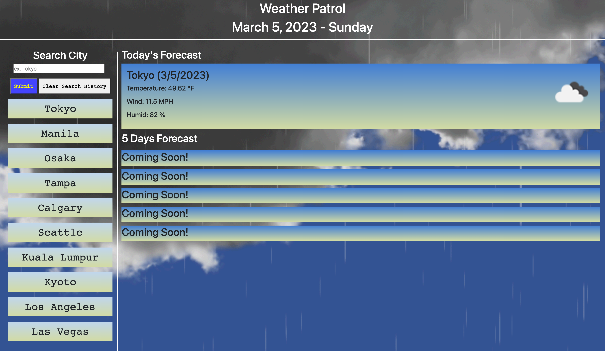

# Weather-Patrol

## Usage
Are you curious whats the weather gonna be like? Or just curious whats the weather gonna be like today or 5 days from now? This app serves a purpose to tell user what the weather is for preparation purposes or just curious what the weather is gonna be like.

## Description
This app includes search history located in the left of the screen to save user searches and information persist when page is refreshed. This will display current day weather depending on cities that the user are searching for. It will also display 5 days weather prediction and today's date under the title that will change as the day go by. It is case sensitive and gave a warning every time the page loads for the first letter of user searches to be capitalize. 
 
## URL
https://jayp308.github.io/weather-patrol/

## Screenshots
Sample Desktop View

## Credits
Junnel R. Padilla, Bootcamp Modules, Stackoverflow, Jquery

## License
MIT License

Copyright (c) 2023 JayP

Permission is hereby granted, free of charge, to any person obtaining a copy
of this software and associated documentation files (the "Software"), to deal
in the Software without restriction, including without limitation the rights
to use, copy, modify, merge, publish, distribute, sublicense, and/or sell
copies of the Software, and to permit persons to whom the Software is
furnished to do so, subject to the following conditions:

The above copyright notice and this permission notice shall be included in all
copies or substantial portions of the Software.

THE SOFTWARE IS PROVIDED "AS IS", WITHOUT WARRANTY OF ANY KIND, EXPRESS OR
IMPLIED, INCLUDING BUT NOT LIMITED TO THE WARRANTIES OF MERCHANTABILITY,
FITNESS FOR A PARTICULAR PURPOSE AND NONINFRINGEMENT. IN NO EVENT SHALL THE
AUTHORS OR COPYRIGHT HOLDERS BE LIABLE FOR ANY CLAIM, DAMAGES OR OTHER
LIABILITY, WHETHER IN AN ACTION OF CONTRACT, TORT OR OTHERWISE, ARISING FROM,
OUT OF OR IN CONNECTION WITH THE SOFTWARE OR THE USE OR OTHER DEALINGS IN THE
SOFTWARE.
